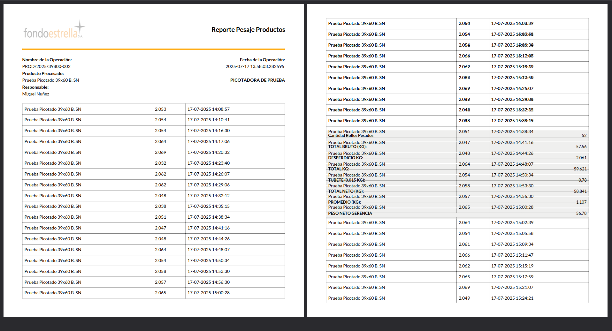

# Conexión entre 'mrp.production' y 'stock.move'
Del modelo de 'stock.move' nos relacionamos mediante el campo May2one production_id con el
<br/>modelo de 'mrp.production' y de forma inversa con el campo de 'move_raw_ids' o 'move_finished_ids'

```python
# 'stock.move' -> 'mrp.production' (Many2one)
production_id = fields.Many2one(
    'mrp.production', 'Production Order for finished products', check_company=True, index='btree_not_null')


# 'mrp.production' -> 'stock.move' (One2many)
move_raw_ids = fields.One2many(
    'stock.move', 'raw_material_production_id', 'Components',
    compute='_compute_move_raw_ids', store=True, readonly=False,
    copy=False,
    domain=[('scrapped', '=', False)])
move_finished_ids = fields.One2many(
    'stock.move', 'production_id', 'Finished Products', readonly=False,
    compute='_compute_move_finished_ids', store=True, copy=False,
    domain=[('scrapped', '=', False)])
```
### Prueba de ejecución
Hacemos la prueba con el registro de 'mrp.production' con name = 'FAB/MO/00028'

```python
mrp = env['mrp.production'].search([('name', '=', 'FAB/MO/00028')])
template = mrp.product_id.product_tmpl_id

# Buscamos el peso de 1 tubete de las líneas (check activado)
lineas = mrp.move_raw_ids.filtered(lambda x: x.product_id.product_tmpl_id.es_tubete)[0]
pesos = []
for e in lineas:
    if e.product_id.product_tmpl_id.weight:
        pesos.append(e.product_id.product_tmpl_id.weight)
    else:
        pesos.append(0)

tubete = self.env['ir.config_parameter'].search([('key', '=', 'tubete')])

# Otros
componentes = mrp.move_raw_ids
desperdicios = mrp.move_byproduct_ids
picotadora = mrp.workorder_ids

""" 
    Tantos los campos de componentes y desperdicios pertenecen al mismo modelo de 'stock.move'
    Me imagino que la única forma de diferenciarlos es por el nombre de '[D<numero>] Desperdicios' que
    tienen todos los de ese tipo. Pueden haber Desperdicios 1 y Desperdicios 2
    Y cuando elegís muchas veces el mismo tipo, no aumentan las líneas de ese tipo, solo aumenta el
    contador nativo que traen con el campo de 'product_uom_qty', pero también nativamente se hace el
    producto de (iteracion1 * peso 1) + (iteracion2 * peso 2) + (iteracion3 * peso 3) + ...

    Resumen: Llamar solo al campo de 'Producido' -> 'quantity_done' que ya tiene la suma almacenada,
    pero de todas las líneas que son del tipo 'Desperdicio N', eso sí o sí tenemos que hacer.

    Dicha suma se tiene que ver reflajada en 1 línea de resumen del reporte
 """
total_desperdicio = sum(mrp.move_byproduct_ids.mapped('quantity_done'))

open('/home/jose/Documentos/clientes/15FONDOESTRELLA/backup/share/picotadora.csv', 'w').close()
with open('/home/jose/Documentos/clientes/15FONDOESTRELLA/backup/share/picotadora.csv', 'w') as f:
    f.write(f'id, valor\n')
    for e in picotadora:
        for x, y in e.read()[0].items():
            f.write(f'"{x}","{y}"\n')

```
### Análisis del error del reporte
Ruta = /home/jose/Documentos/clientes/15FONDOESTRELLA/backup/images/error_balanza.png

El modelo padre del reporte es `'mrp.production'` y el modelo de las líneas del tipo One2many
es `'mrp.workorder'` el cual se accede con el campo de ``workorder_ids``

Lo que tenemos que ver que información y en qué orden trean los registro dicho campo One2many,
posiblemente ese orden es el que está rompiendo el reporte de Fondo Estrella, dejo print del error
para que se entienda.



```python
produccion = env['mrp.production'].search([('name', '=', 'FAB/MO/00033')])

# En el modelo de las líneas 'mrp.workorder' LOCAL
almacenar_peso = {
    "producto1":  {"name": "Picotado Pueblo", "peso": 0.012, "fecha": "04-07-2025 17:36:53"},
    "producto2":  {"name": "Picotado Pueblo", "peso": 0.008, "fecha": "04-07-2025 17:36:56"},
    "producto3":  {"name": "Picotado Pueblo", "peso": 0.156, "fecha": "04-07-2025 17:37:03"},
    "producto4":  {"name": "Picotado Pueblo", "peso": 1.256, "fecha": "04-07-2025 17:37:09"},
    "producto5":  {"name": "Picotado Pueblo", "peso": 0.056, "fecha": "06-08-2025 14:18:30"},
    "producto6":  {"name": "Picotado Pueblo", "peso": 0.089, "fecha": "06-08-2025 14:19:02"},
    "producto7":  {"name": "Picotado Pueblo", "peso": 2.145, "fecha": "06-08-2025 14:19:09"},
    "producto8":  {"name": "Picotado Pueblo", "peso": 8.925, "fecha": "06-08-2025 14:19:31"},
    "producto9":  {"name": "Picotado Pueblo", "peso": 0.234, "fecha": "06-08-2025 14:19:37"},
    "producto10": {"name": "Picotado Pueblo", "peso": 4.567, "fecha": "06-08-2025 14:19:48"},
    "producto11": {"name": "Picotado Pueblo", "peso": 0.089, "fecha": "06-08-2025 14:19:54"},
    "producto12": {"name": "Picotado Pueblo", "peso": 0.234, "fecha": "06-08-2025 14:20:01"},
    "producto13": {"name": "Picotado Pueblo", "peso": 0.078, "fecha": "06-08-2025 14:20:07"},
    "producto14": {"name": "Picotado Pueblo", "peso": 0.566, "fecha": "06-08-2025 14:20:12"},
    "producto15": {"name": "Picotado Pueblo", "peso": 0.879, "fecha": "06-08-2025 14:20:19"},
    "producto16": {"name": "Picotado Pueblo", "peso": 0.156, "fecha": "06-08-2025 14:20:24"},
    "producto17": {"name": "Picotado Pueblo", "peso": 0.896, "fecha": "06-08-2025 14:20:29"},
    "producto18": {"name": "Picotado Pueblo", "peso": 8.965, "fecha": "06-08-2025 14:20:34"},
    "producto19": {"name": "Picotado Pueblo", "peso": 0.032, "fecha": "06-08-2025 14:20:39"},
    "producto20": {"name": "Picotado Pueblo", "peso": 0.369, "fecha": "06-08-2025 14:20:44"},
    "producto21": {"name": "Picotado Pueblo", "peso": 0.512, "fecha": "06-08-2025 14:20:50"},
    "producto22": {"name": "Picotado Pueblo", "peso": 0.145, "fecha": "06-08-2025 14:20:55"},
    "producto23": {"name": "Picotado Pueblo", "peso": 0.632, "fecha": "06-08-2025 14:21:00"},
    "producto24": {"name": "Picotado Pueblo", "peso": 0.156, "fecha": "06-08-2025 14:21:06"},
    "producto25": {"name": "Picotado Pueblo", "peso": 5.698, "fecha": "06-08-2025 14:21:10"},
    "producto26": {"name": "Picotado Pueblo", "peso": 0.365, "fecha": "06-08-2025 14:21:16"},
    "producto27": {"name": "Picotado Pueblo", "peso": 0.589, "fecha": "06-08-2025 14:21:21"},
    "producto28": {"name": "Picotado Pueblo", "peso": 1.456, "fecha": "06-08-2025 14:21:27"},
    "producto29": {"name": "Picotado Pueblo", "peso": 0.354, "fecha": "06-08-2025 14:21:31"},
    "producto30": {"name": "Picotado Pueblo", "peso": 9.878, "fecha": "06-08-2025 14:21:36"},
    "producto31": {"name": "Picotado Pueblo", "peso": 0.056, "fecha": "06-08-2025 14:21:54"},
    "producto32": {"name": "Picotado Pueblo", "peso": 0.897, "fecha": "06-08-2025 14:21:58"},
    "producto33": {"name": "Picotado Pueblo", "peso": 0.235, "fecha": "06-08-2025 14:22:03"},
    "producto34": {"name": "Picotado Pueblo", "peso": 0.659, "fecha": "06-08-2025 14:22:12"},
    "producto35": {"name": "Picotado Pueblo", "peso": 5.678, "fecha": "06-08-2025 14:22:18"},
    "producto36": {"name": "Picotado Pueblo", "peso": 3.256, "fecha": "06-08-2025 14:22:24"},
    "producto37": {"name": "Picotado Pueblo", "peso": 0.698, "fecha": "06-08-2025 14:22:29"},
    "producto38": {"name": "Picotado Pueblo", "peso": 0.265, "fecha": "06-08-2025 14:22:50"},
    "producto39": {"name": "Picotado Pueblo", "peso": 0.069, "fecha": "06-08-2025 14:22:55"},
    "producto40": {"name": "Picotado Pueblo", "peso": 0.698, "fecha": "06-08-2025 14:23:00"},
    "producto41": {"name": "Picotado Pueblo", "peso": 0.265, "fecha": "06-08-2025 14:23:04"},
    "producto42": {"name": "Picotado Pueblo", "peso": 0.035, "fecha": "06-08-2025 14:23:09"},
    "producto43": {"name": "Picotado Pueblo", "peso": 0.235, "fecha": "06-08-2025 14:23:24"},
    "producto44": {"name": "Picotado Pueblo", "peso": 0.056, "fecha": "06-08-2025 14:23:28"},
    "producto45": {"name": "Picotado Pueblo", "peso": 0.045, "fecha": "06-08-2025 14:23:45"},
    "producto46": {"name": "Picotado Pueblo", "peso": 0.069, "fecha": "06-08-2025 14:23:50"},
    "producto47": {"name": "Picotado Pueblo", "peso": 0.056, "fecha": "06-08-2025 14:23:57"},
    "producto48": {"name": "Picotado Pueblo", "peso": 0.568, "fecha": "06-08-2025 14:24:21"},
    "producto49": {"name": "Picotado Pueblo", "peso": 0.089, "fecha": "06-08-2025 14:24:26"},
    "producto50": {"name": "Picotado Pueblo", "peso": 0.096, "fecha": "06-08-2025 14:24:31"},
    "producto51": {"name": "Picotado Pueblo", "peso": 0.056, "fecha": "06-08-2025 14:24:35"},
    "producto52": {"name": "Picotado Pueblo", "peso": 0.962, "fecha": "06-08-2025 14:24:40"}
}    

# En producción SERVIDOR
almacenar_peso = {
    "producto25": {"name": "Prueba Picotado 39x60 B. SN", "peso": 2.053, "fecha": "17-07-2025 14:08:57"},
    "producto26": {"name": "Prueba Picotado 39x60 B. SN", "peso": 2.054, "fecha": "17-07-2025 14:10:41"},
    "producto27": {"name": "Prueba Picotado 39x60 B. SN", "peso": 2.054, "fecha": "17-07-2025 14:16:30"},
    "producto28": {"name": "Prueba Picotado 39x60 B. SN", "peso": 2.064, "fecha": "17-07-2025 14:17:06"},
    "producto29": {"name": "Prueba Picotado 39x60 B. SN", "peso": 2.069, "fecha": "17-07-2025 14:20:32"},
    "producto30": {"name": "Prueba Picotado 39x60 B. SN", "peso": 2.032, "fecha": "17-07-2025 14:23:40"},
    "producto31": {"name": "Prueba Picotado 39x60 B. SN", "peso": 2.062, "fecha": "17-07-2025 14:26:07" },
    "producto32": {"name": "Prueba Picotado 39x60 B. SN", "peso": 2.062, "fecha": "17-07-2025 14:29:06"},
    "producto33": {"name": "Prueba Picotado 39x60 B. SN", "peso": 2.048, "fecha": "17- 07-2025 14:32:12"},
    "producto34": {"name": "Prueba Picotado 39x60 B. SN", "peso": 2.038, "fecha": "17-07-2025 14:35:15"},
    "producto35": {"name": "Prueba Picotado 39x60 B. SN", "peso": 2.0 51, "fecha": "17-07-2025 14:38:34"},
    "producto36": {"name": "Prueba Picotado 39x60 B. SN", "peso": 2.047, "fecha": "17-07-2025 14:41:16"},
    "producto37": {"name": "Prueba Picotado 39x60 B. SN", "peso": 2.048, "fecha": "17-07-2025 14:44:26"},
    "producto38": {"name": "Prueba Picotado 39x60 B. SN", "peso": 2.064, "fecha": "17-07-2025 14:48:07"},
    "producto39": {"name": "Prueba Picotado 39x60 B. SN", "peso": 2.054, "fecha": "17-07-2025 14:50:34"},
    "producto40": {"name": "Prueba Picotado 39x60 B. SN", "peso": 2.058, "fecha": "17-07-2025 14:53:30"},
    "producto41": {"name": "Prueba Picotado 39x60 B. SN", "peso": 2.057, "fecha": "17-07-2025 14:56:30"},
    "producto42": {"name": "Prueba Picotado 39x60 B. SN", "peso": 2.065, "fecha": "17-07-2025 15:00:28" },


    "producto43": {"name": "Prueba Picotado 39x60 B. SN", "peso": 2.064, "fecha": "17-07-2025 15:02:39"},
    "producto44": {"name": "Prueba Picotado 39x60 B. SN", "peso": 2.054, "fecha": "17- 07-2025 15:05:58"},
    "producto45": {"name": "Prueba Picotado 39x60 B. SN", "peso": 2.061, "fecha": "17-07-2025 15:09:34"},
    "producto46": {"name": "Prueba Picotado 39x60 B. SN", "peso": 2.0 66, "fecha": "17-07-2025 15:11:47"},
    "producto47": {"name": "Prueba Picotado 39x60 B. SN", "peso": 2.062, "fecha": "17-07-2025 15:15:19"},
    "producto48": {"name": "Prueba Picotado 39x60 B. SN", "peso": 2.065, "fecha": "17-07-2025 15:17:59"},
    "producto49": {"name": "Prueba Picotado 39x60 B. SN", "peso": 2.069, "fecha": "17-07-2025 15:21:07"},
    "producto50": {"name": "Prueba Picotado 39x60 B. SN", "peso": 2.049, "fecha": "17-07-2025 15:24:21"},
    "producto51": {"name": "Prueba Picotado 39x60 B. SN", "peso": 2.042, "fecha": "17-07-2025 15:27:35"},
    "producto52": {"name": "Prueba Picotado 39x60 B. SN", "peso": 2.048, "fecha": "17-07-2025 15:30:49"}
}